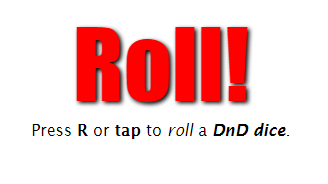

# Roll!

**Feature attuali**:

    1.  Premi R o fai tap per rollare un dado di DnD.
    2.  Seleziona un dado (una faccia) da giocare.
    3.  Il risultato è diviso in:
        - Nome del Dado (la faccia)
        - Risultato randomico secondo le regole di DnD (vedasi implementazione)
        - Risultato : Nome del Dado, Valore randomico, Somma dei valori precenti.

**TODO**:

    1. Pulire un pò il codice. [x]
    2. Migliorare il supporto per dispositivi touch. [x]
    3. Reimplementare in Angular (!?) []

**Bug conosciuti**

    Se si inserisce una faccia inesistente nell'attuale set, esce un numero arbitrariamente scorretto.